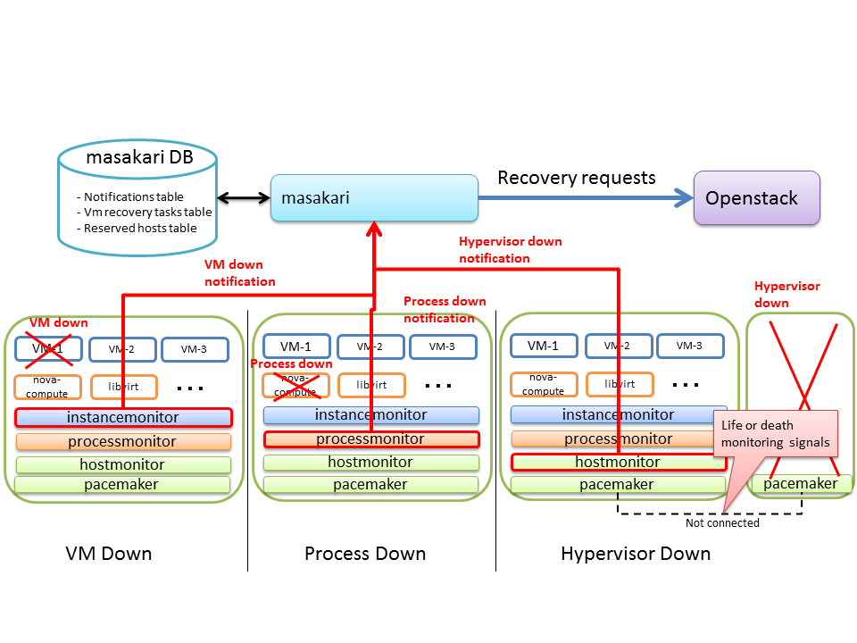

# Masakari

## What is Masakari ?
Masakari provides a Virtual Machine High Availability(VMHA), and
rescues a KVM-based Virtual Machine(VM) from a failure events of the following:

* VM process down              - restart vm (use nova stop API, and nova start API)
* provisioning process down    - restart process or changes nova-compute service status to mentenance mode (use nova service-disable)
* nova-compute host failure    - evacuate all the VMs from failure host to reserved host (use nova evacuate API)

Try [masakari-deploy](https://github.com/ntt-sic/masakari-deploy) for all-in-one scripts to deploy it on your laptop.

## Architecture
* masakari : controller process for failure notification
* instancemonitor : detects the VMs process down
* processmonitor  : detects the fatal control process down on nova-compute node
* hostmonitor     : detects the compute host failure

## Prerequisites
* openstack system
    - Make sure nova and keystone are installed
    - Deploy OpenStack Compute with a shared file system

* pacemaker
    - Setup stonith resources external/ipmi

* packages
    - python-daemon: apt-get install python-daemon
    - dh-make: apt-get install dh-make (it's nessesary in case of Ubuntu)

* create user (user: openstack) and setup passwordless for 'sudo'

* set up '/etc/hosts' or DNS server for host name resolving

## Installation
### components installation

ex) Ubuntu

    # cd (each components directory)  * ex: masakari, hostmonitor etc
    # ./debian/rules binary
    # dpkg -i (each components).deb

### database setting

create database and tables for masakari

    # cd masakari/db
    # vi db.conf
    DB_USER=<mysql user>
    DB_PASSWORD=<mysql user password>
    DB_HOST=<mysql host ip>
    # bash create_vmha_database.sh

### config setting

#### masakari.conf

    # vi /etc/masakari/masakari.conf
    ...
    [db]
    host = <mysql host ip>
    name = vm_ha 
    user = <mysql user>
    passwd = <mysql user password>
    charset = utf8
    ...
    [nova]
    domain = <keystone top level domain name>
    admin_user = <admin user>
    admin_password = <admin user password>
    auth_url =  <auth_url>
    project_name = <tenant name>
    ...

#### instancemonitor.conf

    # vi /etc/instancemonitor/instancemonitor.conf
    [callback]
    # Event notification destination URL
    url = http://<masakari server ip>:15868
    ...
    # regionID
    regionID=<openstack region name. ex) RegionOne >
    ...

#### hostmonitor.conf

    # vi /etc/hostmonitor/hostmonitor.conf
    # URL of recovery controller
    RM_URL="http://<masakari server ip>:15868"
    ...
    # Region unit
    # This item is necessary
    REGION_ID="<openstack region name ex) RegionOne>"

#### processmonitor.conf

    # vi /etc/processmonitor/processmonitor.conf
    RESOURCE_MANAGER_URL="http://<masakari server ip>:15868"
    ...
    REGION_ID=<openstack region name. ex) RegionOne >

## Reserved host setting for nova-compute host failure
If a nova-compute host fails, masakari evacuates instances on the failed host to the reserved host.
In advance, you reserve one or two host(s) per a pacemaker cluster. Please follow this instruction.

    # cd masakari/utils

### Add
    # python reserve_host_manage.py --mode add  --port "226.94.1.1:5405" --host compute2  --db-user root --db-password mysql --db-host 127.0.0.1
### List
    # python reserve_host_manage.py --mode list  --db-user root --db-password mysql --db-host 127.0.0.1
### Delete
    # python reserve_host_manage.py --mode delete  --port "226.94.1.1:5405" --host compute2  --db-user root --db-password mysql --db-host 127.0.0.1
### Update
    # python reserve_host_manage.py --mode update  --port "226.94.1.1:5405"  --before-host compute2  --after-host compute1  --db-user root --db-password mysql --db-host 127.0.0.1

## Copyright
Copyright (C) 2015 [Nippon Telegraph and Telephone Corporation](http://www.ntt.co.jp/index_e.html).
Released under [Apache License 2.0](LICENSE).
